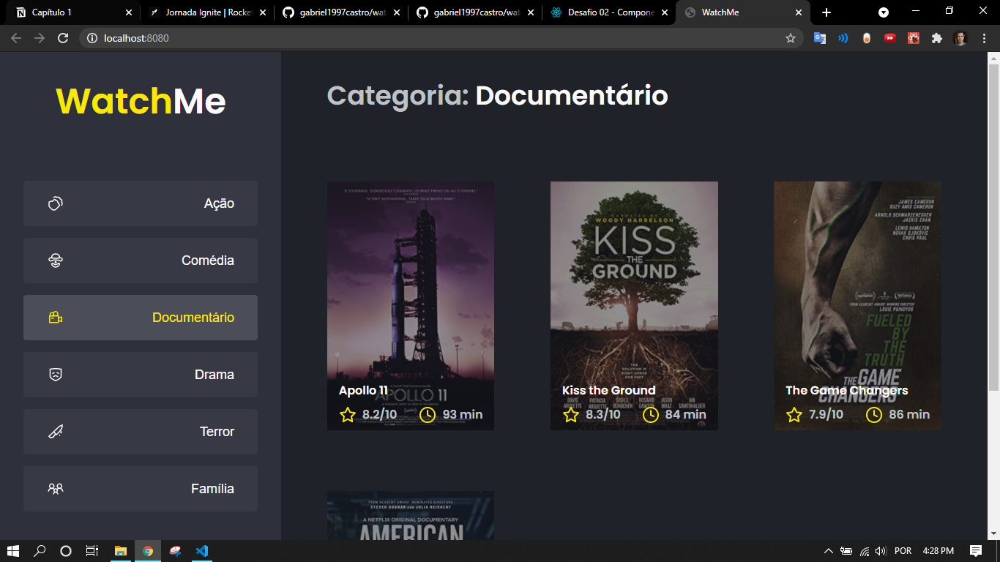

# Watch Me Challenge

## :zap: Sobre
Esta aplicação é um site que mostra uma lista de filmes e suas classificações. Há um json com uma fake api para demonstrar o conteúdo utilizando requisições, como realmente seria feito em um ambiente de produção.

É um desafio feito no programa Ignite da [Rocketseat](https://rocketseat.com.br/). O principal objetivo era componentizar a aplicação já que estava praticamente inteira dentro do App.tsx. Para mais informações segue o clique no [link](https://www.notion.so/Desafio-02-Componentizando-a-aplica-o-b9f0f025c95b437699d0c3115f55b0f1).

## :gear: Dependências
-  [Node.js](https://nodejs.org/en/)
-  [ReactJS](https://reactjs.org/)

## :rocket: Como executar

<pre><code>
  # Instalar dependências
  $ yarn # ou npm install
  # Executar a fake api
  $ yarn server
  # Executar em desenvolvimento
  $ yarn dev # ou npm run dev
</code></pre>

## :camera: Imagem

  

